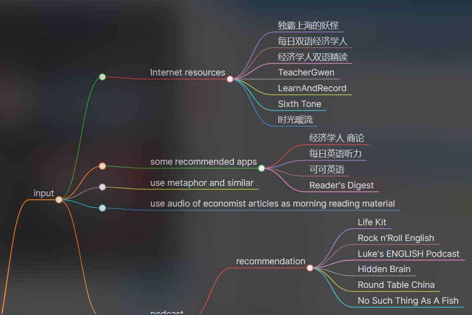
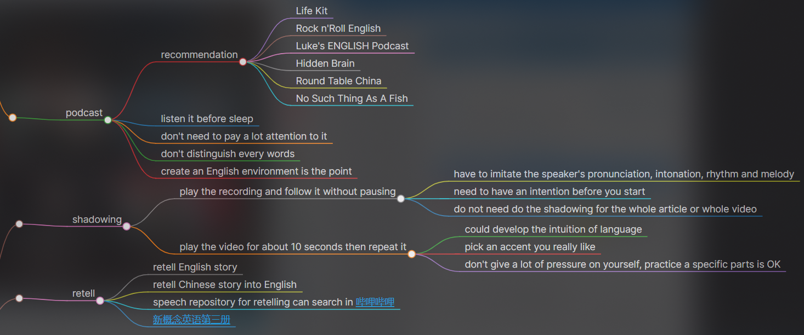
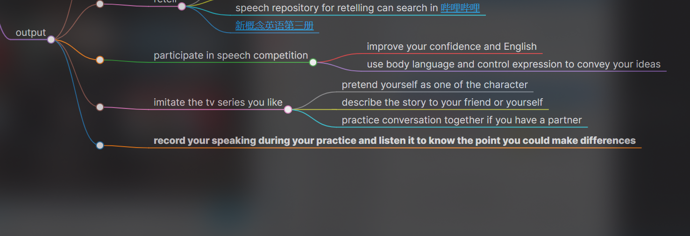

## How to practice Oral English

### input
- Internet resources
	- 独霸上海的妖怪
	- 每日双语经济学人
	- 经济学人双语精读
	- TeacherGwen
	- LearnAndRecord
	- Sixth Tone
	- 时光暖流

- some recommended apps
	- 经济学人 商论
	- 每日英语听力
	- 可可英语
	- Reader's Digest

- use metaphor and similar

- use audio of economist articles as morning reading material

- podcast
	- recommendation
		- Life Kit 
		- Rock n'Roll English
		- Luke's ENGLISH Podcast    
		- Hidden Brain   
		- Round Table China   
		- No Such Thing As A Fish
	- listen it before sleep
	- don't need to pay a lot attention to it
	- don't distinguish every words
	- create an English environment is the point

**input is the foundation of output**

### output
- shadowing
	- play the recording and follow it without pausing
		- have to imitate the speaker's pronunciation, intonation, rhythm and melody
		- need to have an intention before you start
		- do not need do the shadowing for the whole article or whole video
	- play the video for about 10 seconds then repeat it 
		- could develop the intuition of language
		- pick an accent you really like
		- don't give a lot of pressure on yourself, practice a specific parts is OK

- retell
	- retell English story
	- retell Chinese story into English
	- speech repository for retelling can search in [哔哩哔哩](bilibili.com)
	- [新概念英语第三册](https://m.tingclass.net/list-5019-1.html?asc)

- participate in speech competition
	- improve your confidence and English
	- use body language and control expression to convey your ideas

- imitate the tv series you like
	-  pretend yourself as one of the character
	- describe the story to your friend or yourself
	- practice conversation together if you have a partner

- **record your speaking during your practice and listen it to know the point you could make differences**

